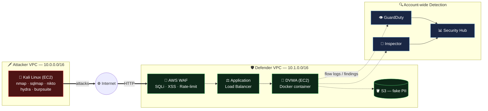
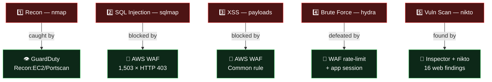

# 🛡️⚔️ Attacking & Defensive Security Lab on AWS

A hands-on cloud security lab where a **Kali Linux attacker** (EC2) launches real attacks against a **deliberately-vulnerable target** (DVWA), while the AWS **defensive security stack** (WAF, GuardDuty, Inspector, Security Hub) detects, blocks, and records the activity. Built and executed entirely via the **AWS CLI** in the `ap-southeast-5` (Malaysia) region.

> **⚠️ Ethics & scope:** Every attack targets **my own resources in my own dedicated lab account**. This is legitimate blue/red-team training. Never point these tools at systems you do not own or lack written authorization to test.

---

## 🎯 What this lab demonstrates

- Building a full attack/defend environment on AWS **from scratch via CLI** (VPCs, EC2, ALB, WAF, IAM, security services)
- Running **5 common attacks** (OWASP Top 10 style) from Kali Linux
- Watching **each AWS defense layer** react (or not) — proving **defense-in-depth**
- A real lesson in **regional service availability** (Macie & Detective are NOT available in Malaysia)
- Cost control: keeping the whole lab **well under budget** with stop/start + teardown

---

## 🏗️ Architecture

Single AWS account, separated by **VPC** (attacker vs defender). Attack traffic flows **over the internet** — just like a real external threat — through the WAF/ALB edge before reaching the vulnerable app. Account-wide detection services watch everything.



> 🖼️ Full AWS-icon diagram: [`lab-architecture.drawio`](./lab-architecture.drawio) (open in [draw.io](https://app.diagrams.net))

### 🔴 Attack flow → 🟢 Defense response



---

## 🧰 Tech stack

| Layer | Service / Tool |
|-------|----------------|
| **Attacker** | Kali Linux on EC2 (nmap, sqlmap, nikto, hydra, Burp Suite, Metasploit) |
| **Target** | DVWA (Damn Vulnerable Web App) in Docker on Amazon Linux 2023 |
| **Edge / defense** | Application Load Balancer + AWS WAF (SQLi, Common, rate-limit rules) |
| **Detection** | Amazon GuardDuty, Amazon Inspector, AWS Security Hub |
| **Data / evidence** | S3 (fake PII), VPC Flow Logs, CloudTrail |
| **Access** | SSM Session Manager / SSH (key pair), all via AWS CLI |

---

## ⚔️ The 5 attacks & what caught them

| # | Attack | Tool | Result | Caught by |
|---|--------|------|--------|-----------|
| 1 | **Reconnaissance** (port scan) | `nmap` | Port 80 (ALB) found; 999 ports filtered | **GuardDuty** `Recon:EC2/Portscan` |
| 2 | **SQL Injection** | `sqlmap` | **Blocked — 1,503 × HTTP 403**; sqlmap detected "AWS WAF" | **AWS WAF** (SQLi rule) |
| 3 | **Cross-Site Scripting (XSS)** | `curl` payloads | Blocked (HTTP 403) | **AWS WAF** (Common rule) |
| 4 | **Brute force** | `hydra` + rockyou | **Defeated** — correct password tried, still "0 valid found"; ~101h to complete | **WAF rate-limit + app/session** |
| 5 | **Vulnerability scan** | `nikto` | 16 findings (outdated Apache, dir indexing, missing headers) | **nikto (web)** + **Inspector (host)** |

**Bonus finding:** GuardDuty Malware Protection scanned the Kali disk and flagged **1,794 malicious files** (`Execution:EC2/MaliciousFile`, severity 8.0) — the pentest toolset itself.

### 📸 Evidence (screenshots + write-ups per attack)
- [Attack 1 — Recon (nmap)](./Evidence/Attack%201%20Recon/)
- [Attack 2 — SQL Injection (sqlmap)](./Evidence/Attack%202%20Sqlmap/)
- [Attack 3 — XSS](./Evidence/Attack%203%20Xss%20(cross-site%20scripting)/)
- [Attack 4 — Brute Force (hydra)](./Evidence/Attack%204%20brute%20force%20(hydra)/)
- [Attack 5 — Vulnerability Scan (nikto + Inspector)](./Evidence/Attack%205%20Vulnerability%20Scan%20on%20(nikto)/)
- [GuardDuty Findings](./Evidence/GuardDuty%20Findings/)
- [Additional GuardDuty Finding — Kali malware scan](./Evidence/Additional%20Findings%20through%20GuardDuty/)

---

## 🔑 Key findings & lessons

1. **Defense-in-depth is real.** The WAF blocked application-layer attacks (SQLi, XSS) but was **blind** to port scans and host malware — those were caught by **GuardDuty**. No single tool catches everything.

2. **A "clean" host can still run a vulnerable app.** Inspector reported **zero package CVEs** on the Amazon Linux 2023 host (it's patched), yet the DVWA app inside the container is full of holes. **Host security ≠ application security.**

3. **Regional service availability matters.** **Amazon Macie** and **Amazon Detective** are **NOT available in `ap-southeast-5` (Malaysia)** — the API endpoints don't even resolve. Always verify service availability when designing for a region. Newer regions lag mature ones (e.g. Singapore `ap-southeast-1` has both).

4. **NAT gateways are a hidden cost.** The lab compute (2 EC2 + ALB + WAF) cost under **$0.20**; security services were free-trial ($0). The account's larger spend traced back to a **leftover NAT gateway** from earlier — a reminder to always clean those up.

5. **Rate limiting defeats brute force.** WAF's rate-based rule + the app's session/CSRF handling meant hydra could not confirm a login even with the correct password in the wordlist.

---

## 📁 Repository structure

```
.
├── README.md                     # this file
├── 01-architecture.md            # detailed architecture + network design
├── 02-attack-plan.md             # the 5 attacks + detection mapping
├── 03-cost-and-teardown.md       # cost estimate + teardown
├── 04-target-app-setup.md        # DVWA setup
├── CLI-DEPLOY-STEP-BY-STEP.md    # full CLI deployment (all phases)
├── RESUME-TOMORROW.md            # stop/start + rebuild steps
├── lab-architecture.drawio       # architecture diagram
├── console-notes/                # console (click-based) deployment notes
├── deploy/                       # CloudFormation template + teardown script
└── Evidence/                     # screenshots + findings per attack
    ├── Attack 1 Recon/
    ├── Attack 2 Sqlmap/
    ├── Attack 3 Xss (cross-site scripting)/
    ├── Attack 4 brute force (hydra)/
    ├── Attack 5 Vulnerability Scan on (nikto)/
    ├── GuardDuty Findings/
    └── Additional Findings through GuardDuty/
```

---

## 🚀 How it was built (high level)

1. **Attacker VPC** + Kali EC2 (SSM/SSH access)
2. **Defender VPC** + DVWA target (Docker) behind **ALB + WAF**
3. Enabled **GuardDuty, Inspector, Security Hub** + VPC Flow Logs
4. Seeded an **S3 bucket with fake PII** (for the Macie test — later found unavailable in region)
5. Ran the **5 attacks** from Kali, collected evidence from each defense
6. **Stopped/torn down** to control cost

Full step-by-step in [`CLI-DEPLOY-STEP-BY-STEP.md`](./CLI-DEPLOY-STEP-BY-STEP.md).

---

## 💰 Cost

- **Lab compute (EC2 + ALB + WAF):** < $0.20
- **Security services:** $0 (30-day free trial)
- **Ongoing (instances stopped):** ~$5/month (EBS storage only)
- Kept well under the $60 budget guardrail.

---

## 🧹 Teardown / cost control

- Instances are **stopped** (not terminated) between sessions → tools persist, ~$0 compute
- ALB + WAF **deleted** when idle (they bill hourly)
- Security services **disabled** after the lab
- See [`03-cost-and-teardown.md`](./03-cost-and-teardown.md) and the teardown script in [`deploy/`](./deploy/)

---

## 📌 Skills demonstrated

`AWS CLI` · `VPC design` · `EC2` · `Application Load Balancer` · `AWS WAF` · `GuardDuty` · `Inspector` · `Security Hub` · `IAM` · `SSM` · `Kali Linux` · `nmap` · `sqlmap` · `nikto` · `hydra` · `DVWA` · `OWASP Top 10` · `defense-in-depth` · `cloud cost management`

---

*Built as a hands-on cloud security exercise on the path to AWS Solutions Architect Associate + cloud security specialization.*
